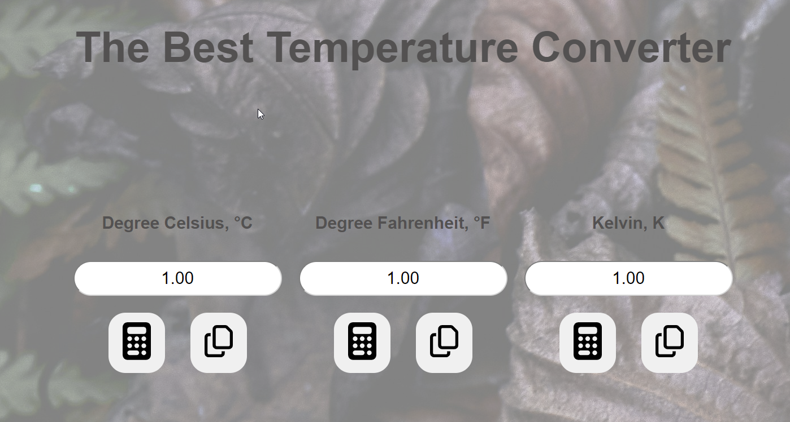
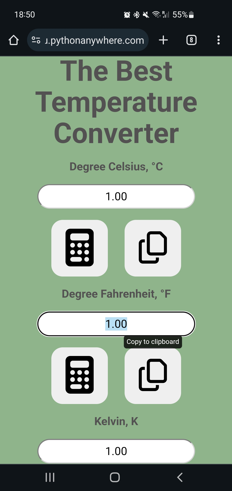
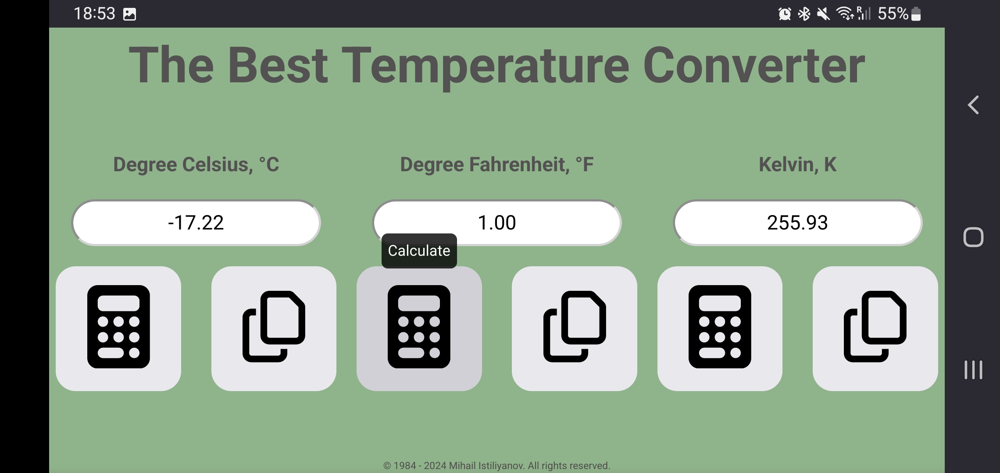

# flask_temperature_convertor_app_for_softuniada_2024

### Description:
This is my first attempt of a Single Page Application (SPA) using Python Flask Web Framework.

### System Requirements:
* OS - Windows 10 or newer, Mac OS, Ubunto, Linux
* IDE - Visual Studio Code 1.87.1 or equivalent
* Python Interpreter - Python 3.11 or newer

### Used Python Libraries:
* Flask - [https://pypi.org/project/pytemp/](https://pypi.org/project/Flask/)

### Final version source code:

[https://github.com/mi6oo6im/my_python_training/blob/main/training_projects/tkinter_tempreture_measurement_converter/Temperature_scales_convertor_with_pytemp_final.py](https://github.com/mi6oo6im/flask_temperature_convertor_app_for_softuniada_2024/)

### Preview:
* Aplication overview - desktop version:   

* Aplication overview - mobile version - portrait:   

* Aplication overview - mobile version - landscape:   

### Demo:
* Pythonanywhere.com:https://tconvert.eu.pythonanywhere.com/   

### External sources:
* QA https://www.rapidtables.com/convert/temperature/index.html
